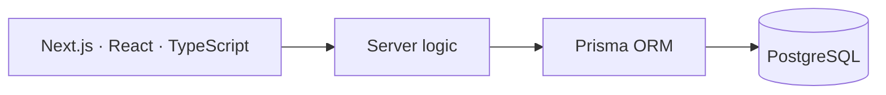
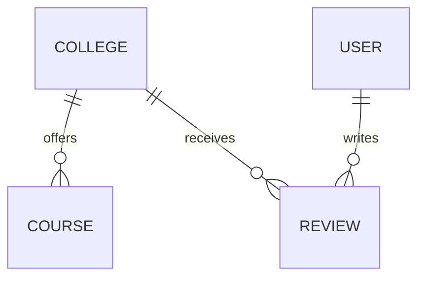

<a id="top"></a>

<div align="center">

```
╔══════════════════════════════════════════════════════════╗
║  PLAYER CARD                                             ║
║                                                          ║
║  NAME      Deep Kevadiya                                 ║
║  CLASS     Full Stack Developer / Competitive Programmer ║
║  LEVEL     3rd year ICT @ PDEU                           ║
║  RANK      Codeforces Pupil                              ║
║  SCORE     800+ problems solved                          ║
║  STACK     TypeScript · React · Next.js · Node · C++     ║
╚══════════════════════════════════════════════════════════╝
```

**[About](#about)** &nbsp;·&nbsp; **[Projects](#projects)** &nbsp;·&nbsp; **[Toolbox](#toolbox)** &nbsp;·&nbsp; **[GitHub](#github)** &nbsp;·&nbsp; **[Problem Solving](#problem-solving)** &nbsp;·&nbsp; **[Contact](#contact)**

<a href="mailto:deepkevadiya18@gmail.com?subject=Hey%20Deep"></a>
<a href="https://www.linkedin.com/in/deep-kevadiya-690303322"></a>
<a href="https://codeforces.com/profile/deepx241"></a>
<a href="https://leetcode.com/u/deep__18/"></a>

</div>

<br/>

<!-- ══════════════ ABOUT ══════════════ -->
<a id="about"></a>

## About

> I build full stack products and solve problems for sport. 800+ problems on the board and a growing set of shipped projects.
>
> **Build. Break. Learn. Repeat.**


<!-- ══════════════ PROJECTS ══════════════ -->
<a id="projects"></a>

## Projects

### CollegeIQ &nbsp;<sub>★ featured</sub>

> **A full-stack platform to discover, compare and review colleges.** Courses, fees, placements, ratings and student reviews in one structured, searchable place.

     

- **Discovery:** browse structured college profiles
- **Comparison:** courses, fees and placement data side by side
- **Community:** ratings and user-written reviews
- **Responsive** across screen sizes

<details>
<summary><b>Architecture and data model</b> <sub>(expand)</sub></summary>
<br/>





</details>

### More work

<details>
<summary><b>Flux Chat</b> &nbsp;<sub>real-time messaging · MERN</sub></summary>
<br/>

A real-time messaging platform focused on instant communication and responsive UX.

- Socket.IO messaging, online/offline presence
- JWT authentication, one-to-one conversations
- Cloudinary image sharing, MongoDB Atlas, REST backend

`React` `Vite` `Tailwind` `Node.js` `Express` `MongoDB` `Socket.IO` `JWT` `Cloudinary`

**[Open repository →](https://github.com/Deepx241/flux-chat)**

</details>

<details>
<summary><b>Problem Tracker</b> &nbsp;<sub>coding progress dashboard</sub></summary>
<br/>

Track progress across LeetCode, Codeforces and other platforms in one place.

- JWT authentication, full CRUD
- Search, filters, sorting and pagination
- Responsive UI

`Next.js` `React` `Node.js` `Express` `MongoDB` `Tailwind` `JWT`

**[Open repository →](https://github.com/Deepx241/problem-tracker)**

</details>

<details>
<summary><b>BlogPort</b> &nbsp;<sub>full-stack blogging platform</sub></summary>
<br/>

Create, edit, publish and manage blogs with a comfortable reading experience.

- Authentication, blog CRUD, REST APIs, responsive design

`React` `Node.js` `Express` `MongoDB` `JWT`

</details>

<details>
<summary><b>AI Resume Builder</b> &nbsp;<sub>ATS-friendly resumes</sub></summary>
<br/>

Generates professional, ATS-friendly resumes with intelligent suggestions.

- AI-assisted generation, ATS-friendly templates, resume export

`React` `Node.js` `MongoDB` `OpenAI API`

</details>


<!-- ══════════════ TOOLBOX ══════════════ -->
<a id="toolbox"></a>

## Toolbox

<p>
<a href="https://isocpp.org/"></a>
<a href="https://developer.mozilla.org/docs/Web/JavaScript"></a>
<a href="https://www.typescriptlang.org/"></a>
<a href="https://react.dev/"></a>
<a href="https://nextjs.org/"></a>
<a href="https://tailwindcss.com/"></a>
<a href="https://vite.dev/"></a>
<a href="https://nodejs.org/"></a>
<a href="https://expressjs.com/"></a>
<a href="https://www.mongodb.com/"></a>
<a href="https://www.postgresql.org/"></a>
<a href="https://www.mysql.com/"></a>
<a href="https://www.prisma.io/"></a>
<a href="https://git-scm.com/"></a>
<a href="https://www.postman.com/"></a>
<a href="https://code.visualstudio.com/"></a>
</p>

<details>
<summary><sub><b>Concepts I work with</b></sub></summary>
<br/>

`Data Structures` `Algorithms` `REST APIs` `Authentication` `Socket.IO` `Database Design` `Responsive UI` `Backend Development`

</details>


<!-- ══════════════ GITHUB ══════════════ -->
<a id="github"></a>

## GitHub

<div align="center">

<picture>
  <source media="(prefers-color-scheme: dark)" srcset="https://github-readme-stats.vercel.app/api?username=Deepx241&show_icons=true&theme=tokyonight&hide_border=true&rank_icon=github&include_all_commits=true&bg_color=0d1117"/>
  
</picture>
<picture>
  <source media="(prefers-color-scheme: dark)" srcset="https://github-readme-stats.vercel.app/api/top-langs/?username=Deepx241&layout=compact&theme=tokyonight&hide_border=true&bg_color=0d1117"/>
  
</picture>

<br/>

<picture>
  <source media="(prefers-color-scheme: dark)" srcset="https://streak-stats.demolab.com?user=Deepx241&theme=tokyonight&hide_border=true&background=0d1117"/>
  
</picture>

<br/><br/>

**Contribution graph, eaten by a snake**

<picture>
  <source media="(prefers-color-scheme: dark)" srcset="https://raw.githubusercontent.com/Deepx241/Deepx241/output/github-snake-dark.svg"/>
  
</picture>

</div>


<!-- ══════════════ PROBLEM SOLVING ══════════════ -->
<a id="problem-solving"></a>

## Problem Solving: 800+ solved

<div align="center">

<a href="https://leetcode.com/u/deep__18/">
<picture>
  <source media="(prefers-color-scheme: dark)" srcset="https://leetcard.jacoblin.cool/deep__18?theme=dark&ext=heatmap"/>
  
</picture>
</a>

<br/>

<a href="https://codeforces.com/profile/deepx241">
  
</a>

</div>


<!-- ══════════════ CONTACT ══════════════ -->
<a id="contact"></a>

## Contact

<div align="center">

<a href="mailto:deepkevadiya18@gmail.com?subject=Hey%20Deep"></a>
<a href="https://www.linkedin.com/in/deep-kevadiya-690303322"></a>
<a href="https://codeforces.com/profile/deepx241"></a>

<br/><br/>

<sub>If you have an interesting problem, I'd love to hear it.</sub>

<br/><br/>

<a href="#top"><sub>↑ back to top</sub></a>

</div>
